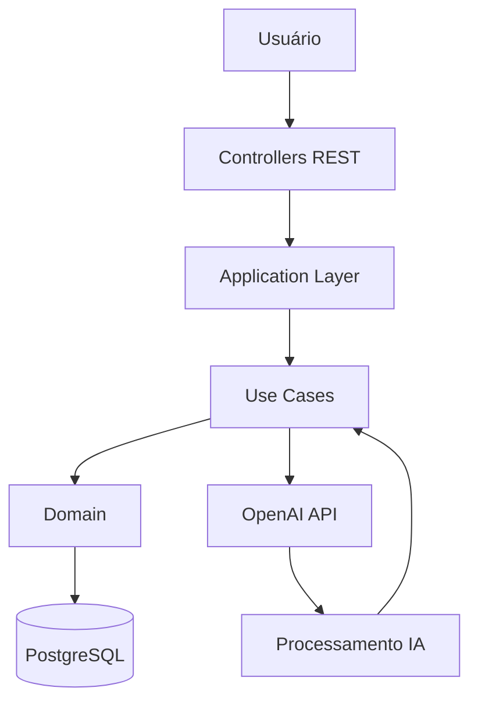
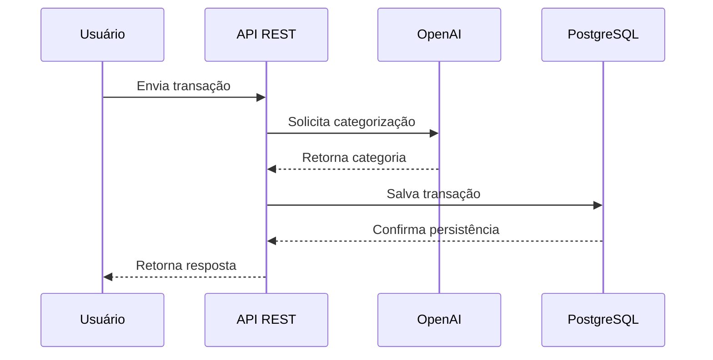

# Budgeting AI

Sistema back-end inteligente para gerenciamento financeiro utilizando IA com Spring Boot e OpenAI.

O projeto foi desenvolvido com foco em:
- arquitetura limpa
- separação de responsabilidades
- integração com IA
- automação de categorização financeira
- processamento de voz e texto

---

# Visão Geral

O Budgeting AI é uma API REST capaz de:

- registrar transações financeiras
- categorizar gastos automaticamente
- utilizar IA para interpretação de dados
- processar texto
- realizar transcrição de áudio
- converter texto em fala
- organizar informações financeiras

---

# Tecnologias Utilizadas

## Back-end
- Java 25
- Spring Boot 4.0.5
- Spring AI
- Gradle

## Inteligência Artificial
- OpenAI API
- Tool Calling
- Prompt Engineering

## Banco de Dados
- Spring Data JPA
- MySQL

## Arquitetura
- Clean Architecture
- Domain Driven Design (DDD)
- DTO Pattern

---

# Estrutura do Projeto

```text
src/main/java/davi/budgeting
│
├── application
│   ├── input
│   ├── output
│   └── use cases
│
├── domain
│   ├── entities
│   ├── repository
│   └── business rules
│
├── infrastructure
│   ├── http
│   └── persistence
│
└── controllers
```

---

# Arquitetura



---

# Funcionalidades

## Registro de transações
Persistência de transações financeiras utilizando regras de domínio e categorização.

## Categorização inteligente
Uso de IA para identificar automaticamente categorias financeiras.

## Transcrição de áudio
Conversão de áudio em texto utilizando modelos de IA.

## Text-to-Speech
Conversão de texto para áudio.

## Tool Calling
Execução automática de ferramentas pela IA durante o fluxo da aplicação.

---

# Exemplo de Fluxo



---

# Endpoints

## Chat Model
```http
POST /api/chat-model
```

## Chat Client
```http
POST /api/chat-client
```

## Transcription
```http
POST /api/transcription
```

## Text To Speech
```http
POST /api/text-to-speech
```

---

# Objetivos do Projeto

- estudar integração com IA
- aplicar Clean Architecture
- trabalhar com APIs REST
- utilizar Spring AI na prática
- explorar automação financeira com inteligência artificial

---

# Possíveis Melhorias Futuras

- autenticação JWT
- dashboard front-end
- geração de relatórios
- análise financeira avançada
- exportação PDF/Excel
- cache com Redis
- deploy em cloud

---

# Como Executar

## Pré-requisitos

- Java 25
- MySQL
- Conta OpenAI 
- Gradle

OBS: Não esqueça que precisa de créditos , já que os tokens desse projeto acabaram!!

---

## Configuração

Crie um arquivo `.env` ou configure:

```properties
OPENAI_API_KEY=your_key
```

---

## application.properties

```properties
spring.datasource.url=jdbc:mysql://localhost:3306/budgeting
spring.datasource.username=root
spring.datasource.password=root
spring.datasource.driver-class-name=com.mysql.cj.jdbc.Driver

spring.jpa.hibernate.ddl-auto=update

spring.ai.openai.api-key=${OPENAI_API_KEY}
```

---

## Executando

```bash
./gradlew bootRun
```

---

# Aprendizados

Durante o desenvolvimento foram trabalhados:

- arquitetura em camadas
- integração com IA
- engenharia de prompts
- persistência de dados
- modelagem de domínio
- organização de código
- consumo de APIs
- tratamento de exceções

---

# Autor

Desenvolvido por Davi Tavares.
